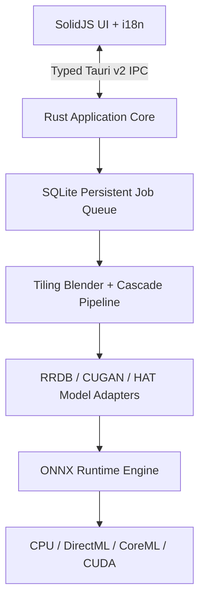

# Resvera

> Restore true detail in photos, illustrations, and anime—locally and offline.
> 纯离线、全平台的高性能 AI 图像超分辨率与画质增强桌面工具。

[](https://github.com/BerryUIKI/resvera/actions/workflows/ci.yml)
[](LICENSE)
[](docs/SECURITY.md)

Resvera is an open-source desktop image upscaler and restoration application built with **Rust**, **Tauri v2**, and **SolidJS**. Image decoding, ONNX Runtime inference, post-processing, metadata filtering, and output encoding run entirely on the user's device. Images, previews, and inference data are never uploaded to the cloud.

---

## ✨ Key Features / 功能亮点

- ⚡ **Pure Offline AI Super-Resolution**: 100% local image upscaling with zero network dependencies during processing.
- 🎯 **Supported Models**:
  - **Real-ESRGAN x4plus** (RRDB, Photography) — *Available & Validated*
  - **Real-ESRGAN x4plus Anime** (RRDB-6B, Anime / Illustrations) — *Available & Validated*
  - **Real-CUGAN 2x / 4x** & **Real-HAT-GAN 4x** — *Core adapters implemented in library; model packages pending export validation ([#68](https://github.com/BerryUIKI/resvera/issues/68))*
- 🚀 **Hardware Acceleration & Execution Providers**:
  - **CPU (SIMD)**: 100% verified cross-platform baseline across Windows, macOS, and Linux.
  - **DirectML / CoreML / CUDA / OpenVINO**: Architecturally integrated, but fail-closed and disabled in production pending physical hardware test evidence ([#68](https://github.com/BerryUIKI/resvera/issues/68)).
- 🎛️ **Precision Image Pipeline**:
  - Rust-native cosine tile feathering & seamless overlap blending
  - Arbitrary custom scale downsampling (Lanczos3)
  - Safe EXIF metadata preservation (`preserveSafe`, `preserveAll`, `stripAll`) with orientation normalization, ICC retention, and GPS scrubbing ([#52](https://github.com/BerryUIKI/resvera/issues/52))
  - Collision-safe atomic disk writing with crash-consistent SQLite queue
- 🔍 **Interactive Comparison Viewer**: Realtime before/after split slider with zoom and pan controls.
- 🔒 **Secure Local Previews**: Scoped asset protocol with dynamic path whitelisting and hardened IPC fallback ([#53](https://github.com/BerryUIKI/resvera/issues/53)).
- 🌐 **Full Internationalization (i18n)**: Instant reactive switching between English (`en-US`) and Simplified Chinese (`zh-CN`).

---

## 📊 Execution Provider Compatibility Matrix

| Provider | Operating System | Status | Notes |
|---|---|---|---|
| **CPU (SIMD)** | Windows / macOS / Linux | ✅ **Production Supported** | Default universal fallback; verified offline across all platforms |
| **DirectML** | Windows 10/11 | ⏳ *In Verification* ([#68](https://github.com/BerryUIKI/resvera/issues/68)) | Fail-closed to CPU until hardware parity reports are published |
| **CoreML** | macOS (Apple Silicon / Intel) | ⏳ *In Verification* ([#68](https://github.com/BerryUIKI/resvera/issues/68)) | Fail-closed to CPU until hardware parity reports are published |
| **CUDA** | Linux x64 | ⏳ *In Verification* ([#68](https://github.com/BerryUIKI/resvera/issues/68)) | Fail-closed to CPU until hardware parity reports are published |
| **OpenVINO** | Linux / Windows | ⏳ *Future Roadmap* | Candidate runtime component |

---

## 📦 Component Implementation vs. Product Status

| Feature / Component | Core Library | Desktop App | Status / Tracking |
|---|---|---|---|
| **Offline Inference Pipeline** | ✅ Implemented | ✅ Shipped | Production ready |
| **RRDB (Real-ESRGAN) Adapter** | ✅ Implemented | ✅ Shipped | Validated with CPU inference |
| **CUGAN / HAT Adapters** | ✅ Implemented | ⏳ Pending Models | Tracked by [#68](https://github.com/BerryUIKI/resvera/issues/68) |
| **Metadata / ICC Preservation** | ✅ Implemented | ✅ Shipped | Fully verified (JPEG/PNG) ([#52](https://github.com/BerryUIKI/resvera/issues/52)) |
| **Persistent Queue & Recovery** | ✅ Implemented | ✅ Shipped | SQLite crash-consistent queue |
| **Model Center Crypto & Staging** | ✅ Implemented | ⏳ Pending Catalog | Engine verified; catalog hosting tracked by [#68](https://github.com/BerryUIKI/resvera/issues/68) |
| **8x Multi-pass Cascading** | ✅ Implemented | ⏳ In Testing | Tracked by [#61](https://github.com/BerryUIKI/resvera/issues/61) |
| **Release Signing & Auto-Updater** | ⏳ In Progress | ⏳ In Progress | Tracked by [#58](https://github.com/BerryUIKI/resvera/issues/58) |

---

## 🏗️ Architecture



---

## 🛠️ Build & Development / 编译与开发指南

### Prerequisites
- [Rust](https://rustup.rs/) (v1.75+)
- [Node.js](https://nodejs.org/) (v20+)
- [pnpm](https://pnpm.io/) (v11+)

### Development Commands
```bash
# 1. Install frontend dependencies
pnpm install

# 2. Run frontend typecheck & build
pnpm run check && pnpm run build

# 3. Run full Rust workspace test suite (60+ tests)
cargo test --workspace

# 4. Launch Tauri v2 desktop development application
pnpm tauri dev
```

---

## 📚 Documentation / 核心文档

- [User Guide / 用户指南](docs/USER_GUIDE.md)
- [Security Architecture & Threat Model](docs/SECURITY.md)
- [System Architecture](docs/ARCHITECTURE.md)
- [API and IPC Specification](docs/API_AND_IPC_SPEC.md)
- [Model Package Specification](docs/MODELS_SPEC.md)
- [Milestone Roadmap & Delivery Progress](docs/ROADMAP.md)

---

## 📜 License

Licensed under the GNU Affero General Public License v3.0 ([AGPL-3.0](LICENSE)).
