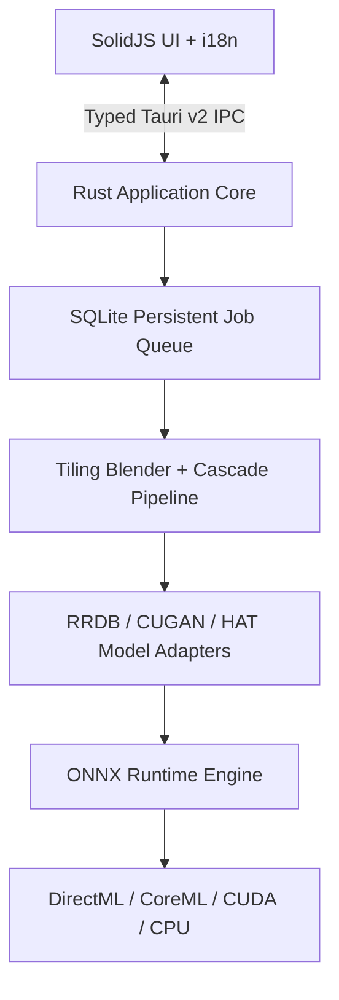

# Resvera

> Restore true detail in photos, illustrations, and anime—locally and offline.
> 纯离线、全平台的高性能 AI 图像超分辨率与画质增强桌面工具。

[](https://github.com/BerryUIKI/resvera/actions/workflows/ci.yml)
[](LICENSE)
[](docs/SECURITY.md)

Resvera is an open-source desktop image upscaler and restoration application built with **Rust**, **Tauri v2**, and **SolidJS**. Image decoding, ONNX Runtime inference, post-processing, metadata filtering, and output encoding run entirely on the user's device. Images, previews, and inference data are never uploaded to the cloud.

---

## ✨ Key Features / 功能亮点

- ⚡ **Pure Offline AI Super-Resolution**: 100% local image upscaling with zero network dependencies during processing.
- 🎯 **Advanced Model Adapters**:
  - **Real-ESRGAN x4plus** (RRDB, Photography)
  - **Real-ESRGAN x4plus Anime** (RRDB-6B, Anime / Illustrations)
  - **Real-CUGAN 2x / 4x** (CUGAN with Reflection Padding & Denoise levels)
  - **Real-HAT-GAN 4x** (Transformer Self-Attention with 16px Window Alignment)
- 🚀 **Hardware Acceleration (Execution Providers)**:
  - Windows: **DirectML** (DirectX 12 GPU)
  - macOS: **CoreML** (Apple Silicon Neural Engine)
  - Linux / Windows: **CUDA** (NVIDIA Tensor Core) & **CPU SIMD** Fallback
- 🛡️ **Cryptographic Model Center**: Staged downloads with Ed25519 signatures and per-chunk SHA-256 integrity verification.
- 🎛️ **Precision Image Pipeline**:
  - Rust-native cosine tile feathering & seamless overlap blending
  - Arbitrary custom scale downsampling (Lanczos3) and 8x multi-pass cascade upscale
  - Safe EXIF metadata preservation (automatic GPS & thumbnail stripping)
  - Collision-safe atomic disk writing
- 🔍 **Interactive Comparison Viewer**: Realtime before/after split slider with smooth zoom and pan controls.
- 🌐 **Full Internationalization (i18n)**: Instant reactive switching between English (`en-US`) and Simplified Chinese (`zh-CN`).

---

## 🏗️ Architecture



---

## 🛠️ Build & Development / 编译与开发指南

### Prerequisites
- [Rust](https://rustup.rs/) (v1.75+)
- [Node.js](https://nodejs.org/) (v20+)
- [pnpm](https://pnpm.io/) (v11+)

### Development Commands
```bash
# 1. Install frontend dependencies
pnpm install

# 2. Run frontend typecheck & build
pnpm run check && pnpm run build

# 3. Run full Rust workspace test suite (25 tests)
cargo test --workspace

# 4. Launch Tauri v2 desktop development application
pnpm tauri dev
```

---

## 📚 Documentation / 核心文档

- [User Guide / 用户指南](docs/USER_GUIDE.md)
- [Security Architecture & Threat Model](docs/SECURITY.md)
- [System Architecture](docs/ARCHITECTURE.md)
- [API and IPC Specification](docs/API_AND_IPC_SPEC.md)
- [Model Package Specification](docs/MODELS_SPEC.md)
- [Milestone Roadmap (100% Completed)](docs/ROADMAP.md)

---

## 📜 License

Licensed under the GNU Affero General Public License v3.0 ([AGPL-3.0](LICENSE)).
