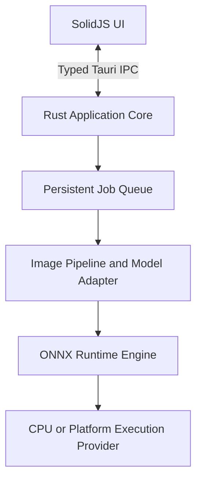

# Resvera

> Restore true detail in photos, illustrations, and anime—locally.

Resvera is an open-source desktop image upscaler and restoration application. Image decoding, AI inference, post-processing, metadata handling, and output encoding run entirely on the user's device. Images and inference data are never uploaded.

Network access is limited to user-approved model downloads, runtime component updates, and application updates. Once the required model and runtime are installed, inference remains available without a network connection.

## Status

Resvera is in architecture and feasibility development. There is no supported release yet. The project will not advertise a model/provider combination until it passes the documented export, parity, memory, and offline tests.

## Planned Features

- Single-image and persistent batch queues.
- Local ONNX Runtime inference with CPU fallback.
- Platform acceleration through DirectML or Windows ML, CoreML, CUDA, and OpenVINO where validated.
- Real-ESRGAN x4plus and Real-ESRGAN x4plus Anime in the MVP.
- Planned Real-CUGAN, Remacri, and Real HAT GAN packages after validation and license review.
- Rust-owned tiling, overlap blending, cancellation, and OOM recovery.
- Before/after comparison with pan and zoom.
- PNG, JPEG, and WebP input/output.
- Native and custom output scales, including explicit cascade plans.
- Selective metadata preservation.
- Signed model and runtime catalogs with verification and rollback.
- No cloud inference or implicit job-time downloads.

## Architecture

The first release uses one inference engine: ONNX Runtime. DirectML, CoreML, CUDA, OpenVINO, and CPU are Execution Providers within that engine. The engine boundary remains stable so another engine can be added later without changing the queue or IPC contract.

## Initial Model Plan

| Product model | Canonical model | Native scale | Planned phase |
|---|---|---:|---|
| Real-ESRGAN x4plus | `RealESRGAN_x4plus` | 4x | MVP |
| Real-ESRGAN x4plus Anime | `RealESRGAN_x4plus_anime_6B` | 4x | MVP |
| Real-CUGAN | Official multi-scale model sets | 2x/3x/4x | v0.2 |
| Remacri | `4x-Remacri` | 4x | v0.2, pending provenance approval |
| Real HAT GAN x4 | `Real_HAT_GAN_SRx4` | 4x | v0.3 |

Resvera publishes its own reproducibly exported and validated ONNX model packages. It does not treat arbitrary third-party conversions as production artifacts.

## Offline Guarantee

For an installed model and runtime:

- inference opens no network connections;
- no image, path, preview, metadata, tensor, or output is uploaded;
- no cloud fallback exists;
- no dependency or model is downloaded when a job starts;
- update checks can be disabled;
- installed components continue working offline indefinitely;
- telemetry is disabled by default.

Model and component downloads use explicit user consent, signed catalogs, SHA-256 verification, and atomic installation.

## Technology

| Layer | Technology |
|---|---|
| Frontend | SolidJS, TypeScript, Vite, Tailwind CSS |
| Desktop | Tauri v2 |
| Core | Rust, Tokio |
| Inference | ONNX Runtime behind an application-owned engine adapter |
| Acceleration | Platform-specific ONNX Runtime Execution Providers |
| Model format | Signed Resvera packages containing validated ONNX artifacts |

Exact dependency and runtime versions will be pinned in source control. Bundle size is secondary to reliability, offline availability, and reproducibility.

## Documentation

- [System Architecture](docs/ARCHITECTURE.md)
- [Technology Stack](docs/TECH_STACK.md)
- [Model Package Specification](docs/MODELS_SPEC.md)
- [API and IPC Specification](docs/API_AND_IPC_SPEC.md)
- [Roadmap](docs/ROADMAP.md)

## Development

Build instructions will be added after the feasibility gates and project scaffold are complete. Until then, commands in issues or draft documents should not be considered a supported build procedure.

## License

The intended application license is AGPL-3.0. Model packages retain their own upstream licenses and notices. A model is not published in the Resvera catalog until its provenance and redistribution status are recorded.

## Acknowledgements

Resvera builds on research and open-source work from the Real-ESRGAN, Real-CUGAN, HAT, ONNX Runtime, Tauri, SolidJS, and broader image-restoration communities. Model-specific attribution and license notices are included in each installed model package.
