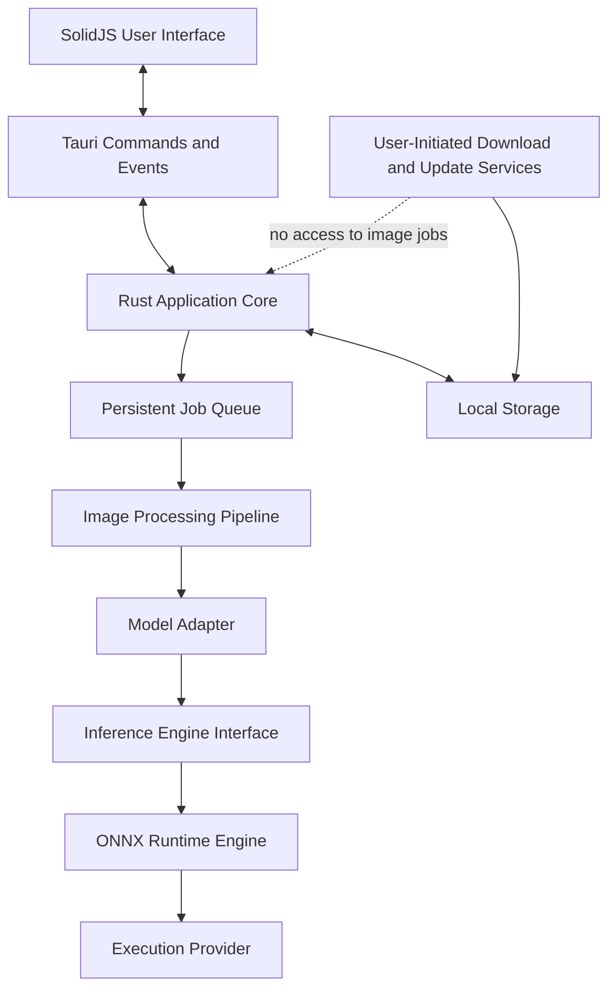
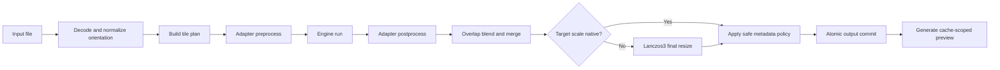
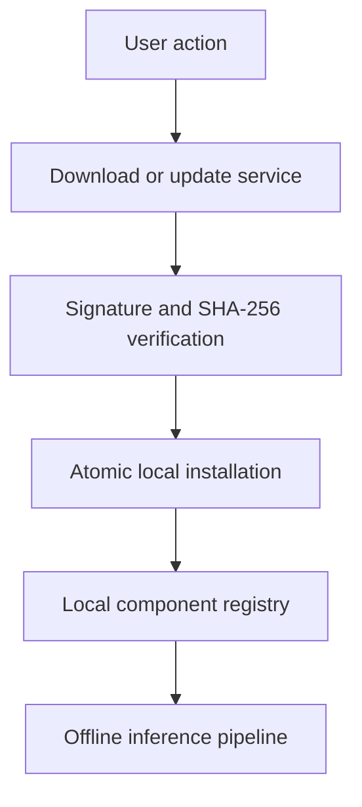

# Resvera System Architecture

## 1. Architectural Goals

Resvera is a cross-platform desktop image restoration application. Its architecture is designed around five non-negotiable properties:

1. Image inference is performed entirely on the user's device.
2. The inference pipeline never requires network access.
3. The initial inference engine is ONNX Runtime, with CPU execution always available.
4. Model-specific behavior is isolated from runtime-specific behavior.
5. Additional inference engines can be added later without changing the queue, IPC contract, or user workflow.

The application may access the network only for user-approved model downloads, runtime component updates, and application updates. These services are separate from the inference path.

## 2. Layered Architecture



### 2.1 Frontend

The SolidJS frontend renders controls, previews, queue state, model availability, and settings. It does not read arbitrary files, execute inference, download components, or write application state directly. All privileged operations go through typed Tauri commands.

### 2.2 Rust Application Core

The Rust core owns:

- job validation and persistent queue state;
- image decoding, color conversion, tiling, overlap blending, and encoding;
- inference engine and execution-provider selection;
- model package validation and installation;
- settings and output naming;
- cancellation and application lifecycle handling;
- explicit model, runtime, and application update workflows.

### 2.3 Inference Runtime

ONNX Runtime is the only inference engine in the initial release. Hardware acceleration is provided through platform-specific Execution Providers (EPs). The default CPU EP is always installed and is the final fallback.

An EP is not treated as a separate inference engine. DirectML, CoreML, CUDA, OpenVINO, and CPU all execute through the same `OrtEngine` implementation.

## 3. Stable Abstraction Boundaries

### 3.1 Inference Engine

No ONNX Runtime or Rust binding types may cross this interface.

```rust
pub trait InferenceEngine: Send + Sync {
    fn id(&self) -> EngineId;
    fn capabilities(&self) -> EngineCapabilities;
    fn probe(&self) -> Result<EngineHealth, EngineError>;
    fn load(&self, artifact: &ModelArtifact) -> Result<Box<dyn ModelSession>, EngineError>;
    fn run(
        &self,
        session: &mut dyn ModelSession,
        input: TensorView<'_>,
        cancel: &CancellationToken,
    ) -> Result<OwnedTensor, EngineError>;
}
```

The initial implementation is `OrtEngine`. A future `MnnEngine` or `NcnnEngine` must be addable without modifying queue or IPC types.

### 3.2 Execution Provider

Provider selection is capability-based:

1. Use the user-selected provider when it is installed, healthy, and supported by the selected model.
2. Otherwise use the highest-priority healthy provider in automatic mode.
3. Fall back to the ONNX Runtime CPU EP.
4. Surface a clear error only when the model cannot run on CPU or the runtime/model package is invalid.

The planned platform order is:

| Platform | Automatic provider order |
|---|---|
| Windows 11 | Windows ML-discovered provider, DirectML, CPU |
| Windows compatibility path | DirectML, CPU |
| macOS | CoreML, CPU |
| Linux with NVIDIA GPU | CUDA, CPU |
| Linux with supported Intel hardware | OpenVINO, CPU |
| Other Linux systems | CPU |

Provider availability is probed at runtime. Resvera never silently downloads a provider while starting a job.

### 3.3 Model Adapter

The model adapter owns model-family semantics that do not belong in the inference engine:

```rust
pub trait ModelAdapter: Send + Sync {
    fn family(&self) -> ModelFamily;
    fn validate_manifest(&self, manifest: &ModelManifest) -> Result<(), ModelError>;
    fn tile_constraints(&self, manifest: &ModelManifest) -> TileConstraints;
    fn preprocess(&self, tile: &ImageTile) -> Result<OwnedTensor, PipelineError>;
    fn postprocess(&self, output: OwnedTensor) -> Result<ImageTile, PipelineError>;
}
```

Initial adapters:

- `RrdbAdapter` for Real-ESRGAN and Remacri;
- `RealCuganAdapter` for multi-scale and multi-strength Real-CUGAN packages;
- `HatAdapter` for HAT window-size and padding requirements.

This separation prevents model-specific arguments from leaking into `OrtEngine`.

## 4. Inference Pipeline



### 4.1 Image Formats

The Rust image pipeline, not the model runtime, owns file-format support. Every supported input is decoded into a normalized in-memory RGB/RGBA representation before inference. Model tensors never depend on the source container format.

The initial required formats are PNG, JPEG, and WebP. Additional formats must be enabled only after decode, encode, alpha, bit-depth, and metadata behavior are covered by tests.

### 4.2 Tiling

Tiling is implemented in Rust and is independent of the execution provider. A tile plan considers:

- source dimensions and requested scale;
- model-family alignment and window constraints;
- provider memory information when available;
- a conservative provider/model default when memory information is unavailable;
- user override;
- overlap and crop margins.

Progress is reported by completed tile weight, not by parsing runtime console output. OOM recovery reduces the tile dimensions to the next valid aligned value and recreates the affected session when required. Recovery has a bounded retry count and never changes providers unless the job policy permits fallback.

### 4.3 Scale Strategy

- A native model scale is preferred.
- A target below the native scale runs once at native scale and then uses Lanczos3 downsampling.
- An 8x request on a 4x-only model runs two 4x passes to produce 16x and then downsamples to 8x.
- Cascade work is represented as multiple pipeline stages and is not expected to take only twice as long as a single pass.

## 5. Job Queue and Lifecycle

Only one inference job runs at a time in the initial release. Image decoding and preview generation may use bounded background concurrency, but only one model session may actively perform inference.

Job states are:

```text
queued -> preparing -> running -> finalizing -> succeeded
   |          |          |            |
   +----------+----------+------------+-> cancelled
                         |
                         +--------------> failed
```

Queue state is persisted before a command reports success. On application restart:

- `queued` jobs remain queued;
- interrupted `preparing`, `running`, or `finalizing` jobs become `interrupted` and may be retried explicitly;
- successfully committed output files remain discoverable through history.

Closing the final application window requests an orderly application shutdown. The running inference job is cancelled, temporary files are cleaned, and queue state is persisted. Resvera does not claim to continue processing after the GUI closes in the initial release.

Because ONNX Runtime runs in-process, there are no inference sidecars or zombie inference processes to manage.

## 6. Cancellation and Failure Recovery

Cancellation is cooperative and idempotent:

- cancelling an already terminal job succeeds without changing it;
- the cancellation token is checked between tiles and passed into the runtime adapter where supported;
- partially written outputs remain in an application-owned temporary directory;
- temporary files are deleted after cancellation or failure unless diagnostic retention is enabled;
- final outputs are created with an atomic rename and are never partially overwritten.

Provider failure and OOM errors are distinct. Automatic mode may retry with a smaller tile and then CPU according to policy. Explicit provider mode retries tile size but does not silently switch providers.

## 7. Output and Metadata Safety

The default output name is deterministic and collision-safe:

```text
{stem}_{model}_{scale}x.{extension}
```

If the path exists, Resvera appends an incrementing suffix unless the user explicitly enabled overwrite. Input files are never overwritten by default.

Metadata preservation is selective. Safe descriptive EXIF fields may be copied, while orientation, pixel dimensions, embedded thumbnails, and other representation-dependent fields are normalized, updated, or removed. GPS metadata follows the user's preservation setting.

## 8. Local Preview Security

Full-resolution outputs remain in the user-selected output directory. UI previews are generated in the application cache and served only from a narrowly scoped Tauri asset-protocol directory. Arbitrary user directories are not globally exposed to the WebView.

The Tauri configuration must:

- enable the asset protocol only for the preview cache;
- include `asset:` and `http://asset.localhost` in the image CSP;
- deny hidden and unrelated application-data paths;
- delete stale previews according to the cache policy.

## 9. Offline and Network Boundary

The inference dependency graph contains no HTTP client. Network-capable services are separate application modules:



Rules:

- no image, path, thumbnail, EXIF data, tensor, or inference result is uploaded;
- no cloud inference fallback exists;
- a job never triggers an implicit model or dependency download;
- update checks can be disabled;
- installed models and runtime components remain usable indefinitely without a network connection;
- telemetry is disabled by default, including ONNX Runtime telemetry;
- downloads use HTTPS, a signed catalog, SHA-256 verification, and atomic installation;
- failure to update never invalidates a working installed component.

## 10. Observability

Logs are local and structured. Sensitive absolute paths are redacted in exported diagnostics unless the user explicitly includes them. Diagnostics record engine version, provider, model package version, tile plan, retry decisions, and normalized error codes. They never contain image pixels or embedded metadata.
