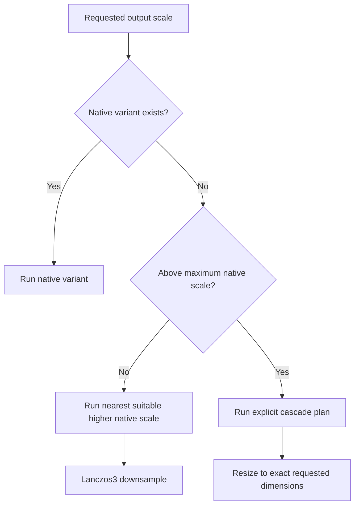

# Resvera Model Package Specification

## 1. Scope

Resvera distributes validated model packages for offline local inference. ONNX is the only model artifact format supported by the initial `OrtEngine`. Original PyTorch weights are used as conversion sources but are not loaded by the desktop application.

Every production package is immutable, content-addressed, licensed, and reproducibly derived from an identified upstream source.

## 2. Initial Model Catalog

| Product name | Canonical upstream model | Family | Native scale | Package form | Initial phase |
|---|---|---|---|---|---|
| Real-ESRGAN x4plus | `RealESRGAN_x4plus` | RRDB | 4x | Single ONNX artifact | MVP |
| Real-ESRGAN x4plus Anime | `RealESRGAN_x4plus_anime_6B` | RRDB-6B | 4x | Single ONNX artifact | MVP |
| Real-CUGAN | Official Real-CUGAN model sets | CUNet | 2x, 3x, 4x | Multi-artifact model pack | v0.2 |
| Remacri | `4x-Remacri` | ESRGAN/RRDB | 4x | Single ONNX artifact | v0.2, subject to provenance approval |
| Real HAT GAN x4 | `Real_HAT_GAN_SRx4` | HAT | 4x | Single ONNX artifact with static tile constraints | v0.3 |

The catalog must not use ambiguous labels such as “HAT-GAN” when an exact upstream checkpoint is intended.

## 3. Package Layout

```text
<model-id>/<package-version>/
├── manifest.json
├── checksums.json
├── LICENSE.txt
├── NOTICE.md
└── artifacts/
    ├── model.onnx
    └── ...
```

Real-CUGAN packages may contain several artifacts for scale and denoise-strength variants. A package is installed only when every required file has passed signature and checksum verification.

## 4. Manifest

```json
{
  "schema_version": 1,
  "id": "realesrgan-x4plus",
  "package_version": "1.0.0",
  "display_name": "Real-ESRGAN x4plus",
  "family": "rrdb",
  "category": "photo",
  "description": "General-purpose 4x restoration for photographic images.",
  "license": {
    "spdx": "BSD-3-Clause",
    "upstream_url": "https://github.com/xinntao/Real-ESRGAN",
    "redistribution_review": "approved"
  },
  "provenance": {
    "upstream_repository": "https://github.com/xinntao/Real-ESRGAN",
    "upstream_revision": "<full-commit-sha>",
    "source_weight_name": "RealESRGAN_x4plus.pth",
    "source_weight_sha256": "<sha256>",
    "export_recipe": "exports/realesrgan-x4plus/v1.toml"
  },
  "variants": [
    {
      "id": "x4-default",
      "native_scale": 4,
      "strength": null,
      "artifact": "artifacts/model.onnx"
    }
  ],
  "tensor": {
    "input_name": "input",
    "output_name": "output",
    "layout": "NCHW",
    "channels": "RGB",
    "input_range": [0.0, 1.0],
    "output_range": [0.0, 1.0],
    "element_type": "float32"
  },
  "tiling": {
    "alignment": 1,
    "minimum": 32,
    "recommended": 256,
    "overlap": 16,
    "window_size": null,
    "static_shapes_required": true
  },
  "compatibility": {
    "engine": "onnx-runtime",
    "minimum_engine_version": "<pinned-version>",
    "validated_providers": ["cpu", "directml", "coreml", "cuda", "openvino"],
    "validated_precisions": ["fp32"]
  },
  "artifacts": [
    {
      "path": "artifacts/model.onnx",
      "size_bytes": 0,
      "sha256": "<sha256>"
    }
  ]
}
```

Placeholder values are allowed in documentation examples only. Published catalog entries must contain concrete immutable values.

## 5. Manifest Rules

- `schema_version` controls manifest parsing and migration.
- `id` is stable across package versions.
- `package_version` follows SemVer for packaging and conversion changes.
- `family` selects a registered `ModelAdapter`.
- `variants` describe actual separately validated artifacts, not UI-only scale aliases.
- `provenance` identifies the exact upstream source and reproducible export recipe.
- `tensor` fully defines the runtime contract.
- `tiling` defines model-family constraints; provider heuristics may choose a smaller valid tile.
- `compatibility` is an allowlist created by validation, not an assumption based on ONNX conformance.
- `artifacts` lists every file required for an atomic install.

Unknown required fields or unsupported schema versions cause installation to fail safely.

## 6. Model-Family Requirements

### 6.1 Real-ESRGAN

The MVP packages are derived from the official `RealESRGAN_x4plus` and `RealESRGAN_x4plus_anime_6B` checkpoints. Both are exposed as native 4x models. Arbitrary target scales are implemented by the application pipeline, not embedded in the ONNX graph.

The package must include parity fixtures for RGB, grayscale-expanded-to-RGB, and alpha-preserving image paths.

### 6.2 Real-CUGAN

Real-CUGAN is a model pack, not one interchangeable file. The manifest must describe:

- native scale of 2x, 3x, or 4x;
- denoise/enhancement-strength identifier;
- all artifacts required by the selected official configuration;
- adapter-specific padding and cache behavior;
- the exact mapping from the user-facing strength control to an artifact variant.

The application must never simulate a Real-CUGAN strength by interpolating unrelated output tensors unless a separately validated algorithm is documented.

### 6.3 Remacri

Remacri uses the RRDB-family adapter. It remains excluded from the signed production catalog until the original checkpoint source, author attribution, license terms, and redistribution rights are documented. Technical convertibility is not sufficient for distribution approval.

### 6.4 Real HAT GAN

The HAT adapter owns window-size alignment, reflection padding, crop restoration, and static tile-shape selection. Each provider must pass operator-coverage and visual parity tests. A provider that silently assigns a material portion of the graph to CPU must be reported accurately in diagnostics and performance claims.

## 7. Scale Processing



Exact output dimensions are calculated from the original dimensions using checked integer arithmetic. Scale conversion is included in progress and cancellation behavior.

## 8. Export and Validation

Every published artifact must pass:

1. ONNX structural validation.
2. Deterministic export from pinned upstream source and dependencies.
3. Reference comparison against the official implementation on a versioned fixture set.
4. Tile seam and whole-image parity tests.
5. Provider-specific output tolerance tests.
6. FP16 validation before FP16 is advertised.
7. Peak-memory and OOM-recovery tests.
8. License and attribution review.
9. Malware scanning and immutable SHA-256 generation.
10. Signed catalog publication.

Validation reports are stored with release engineering artifacts and include runtime, driver, device, and provider versions.

## 9. Storage and Registry

```text
app_data_dir()/
├── models/
│   └── <model-id>/
│       ├── <package-version>/
│       └── current.json
├── runtimes/
│   └── <component-id>/<version>/
├── catalogs/
│   ├── models.signed.json
│   └── runtimes.signed.json
└── transactions/
```

`current.json` is changed only after a new package is fully verified. The previous version remains available for rollback until retention policy cleanup.

## 10. Download and Installation

The model manager exposes explicit install, cancel, retry, remove, verify, and rollback operations. The workflow is:

1. Resolve a version from the signed catalog.
2. Ask for user confirmation and show size/license information.
3. Download to a transaction-specific temporary location.
4. Support resumable downloads when the server supports ranges.
5. Verify catalog signature and every artifact SHA-256.
6. Validate the manifest and ONNX graph.
7. Atomically move the package into the model registry.
8. Update the active-version pointer transactionally.

Removing a model never removes outputs produced by that model. An in-use model version cannot be removed until its session and jobs have ended.

## 11. Custom Models

Custom import is deferred until after the signed catalog pipeline is stable. The initial custom format is an ONNX file plus a complete user-supplied manifest. Resvera does not infer scale, tensor layout, color order, window size, or model family from a filename.

Custom models are clearly marked unverified. Import performs structural validation and an optional local test inference, but it does not claim quality, safety, or provider compatibility.
