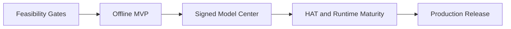

# Resvera Roadmap

## 1. Delivery Principles

Resvera is delivered in evidence-driven milestones. A milestone is complete only when its acceptance criteria and required test artifacts pass in CI or on the declared hardware matrix.

The roadmap does not defer foundational boundaries:

- ONNX Runtime is the initial inference engine.
- The engine, execution provider, and model adapter are separate abstractions from the first implementation.
- CPU inference is always available.
- Image inference remains offline.
- Models and runtime components use signed, versioned packages.
- Queue and installation state are crash-consistent.
- Unsupported performance or compatibility claims are not published.

## 2. Milestone 0: Feasibility and Architecture Gates

**Goal:** Remove model, provider, licensing, and persistence uncertainty before building the product surface.

### Deliverables

- Architecture Decision Records for ONNX Runtime, persistence, model packaging, and offline/network boundaries.
- Reproducible ONNX export for `RealESRGAN_x4plus` and `RealESRGAN_x4plus_anime_6B`.
- Golden-image parity suite against the official reference implementation.
- Proof of inference through CPU, DirectML, and CoreML on representative systems.
- HAT export spike using the exact `Real_HAT_GAN_SRx4` checkpoint and static tile shapes.
- Real-CUGAN export investigation covering its multi-artifact scale/strength configurations.
- Remacri provenance and redistribution review.
- Signed model-catalog proof of concept.
- Transactional persistence prototype with simulated crash recovery.

### Acceptance Criteria

- [ ] Both MVP Real-ESRGAN models export deterministically from pinned upstream weights.
- [ ] FP32 ONNX output passes the recorded numerical and visual parity thresholds on the fixture suite.
- [ ] CPU inference completes without a GPU API or network connection.
- [ ] DirectML and CoreML either pass the parity suite or are explicitly removed from the advertised MVP matrix.
- [ ] The model package signature, SHA-256 verification, failed-install rollback, and active-version rollback are demonstrated.
- [ ] The queue recovers correctly after termination at each persistent state transition.
- [ ] Remacri has an approved provenance record or is formally excluded from the production catalog.
- [ ] HAT and Real-CUGAN findings are recorded with concrete blockers, supported shapes, and provider results.

No UI implementation should make model/provider claims before this gate passes.

## 3. Milestone 1: Offline MVP

**Goal:** Deliver a complete local single-image and batch workflow using the two validated Real-ESRGAN packages.

### Deliverables

- Tauri v2, Rust, SolidJS, TypeScript, Vite, and Tailwind project scaffold.
- Stable `InferenceEngine`, `ModelSession`, and `ModelAdapter` interfaces.
- `OrtEngine` with CPU provider and validated platform acceleration.
- RRDB adapter and Rust-owned tiling, overlap blending, progress, and cancellation.
- Persistent serial queue with single and batch job creation.
- PNG, JPEG, and WebP input/output pipeline.
- Collision-safe atomic output writing.
- Before/after comparison, pan, zoom, and cache-scoped previews.
- Provider status and automatic/explicit provider selection.
- Local settings and job history.
- No network dependency in the inference path.

### Acceptance Criteria

- [ ] A clean installation with an installed model completes inference while all network access is blocked.
- [ ] Network inspection confirms that starting and completing jobs opens no network connections.
- [ ] CPU-only inference succeeds for both MVP models.
- [ ] Every advertised accelerated provider passes the same golden-image suite.
- [ ] Output dimensions are exact for native and post-downsampled scales.
- [ ] Tile and whole-image output remain within the package-defined parity threshold, with no visible seams in the fixture suite.
- [ ] Cancelling during preparation, inference, merge, resize, and encode leaves no partial final output.
- [ ] Closing the application cancels the active job, persists state, and exits cleanly.
- [ ] Restart converts interrupted active work to `interrupted` and preserves queued jobs and completed history.
- [ ] A batch of 100 mixed-size fixture jobs completes without unbounded memory growth.
- [ ] Existing output files are never overwritten unless overwrite was explicitly enabled.
- [ ] Arbitrary filesystem paths cannot be loaded by the WebView asset protocol.
- [ ] The UI becomes interactive within the benchmark budget before any model session is initialized.

Performance budgets must be stored with exact hardware, operating system, driver, provider, model version, tile shape, precision, input format, and source dimensions. Informal labels such as “mid-range GPU” are not acceptance criteria.

## 4. Milestone 2: Signed Model Center and Advanced Output

**Goal:** Add controlled online acquisition while preserving permanently offline inference.

### Deliverables

- Signed model and runtime-component catalogs.
- Explicit install, resume, cancel, retry, verify, remove, and rollback workflows.
- Real-CUGAN model packs after Milestone 0 validation.
- Remacri package only if provenance review is approved.
- Selective metadata preservation.
- Native multi-scale model selection.
- Exact custom target scaling and 8x cascade plans.
- Output naming template configuration.
- JPEG quality and WebP lossless/lossy controls.
- Download and update settings, including disabling automatic checks.

### Acceptance Criteria

- [ ] A model download is installed only after catalog signature and all artifact hashes pass.
- [ ] Corruption, signature failure, cancellation, or loss of connectivity leaves the previously active package usable.
- [ ] Model version rollback works without re-downloading when the previous version is retained.
- [ ] Starting a job with a missing model produces `modelNotInstalled` and never initiates a download.
- [ ] Real-CUGAN exposes only validated scale and strength combinations from its package manifest.
- [ ] Remacri is absent when redistribution approval is not recorded.
- [ ] `preserveSafe` updates or removes orientation, dimensions, and embedded thumbnails correctly.
- [ ] GPS metadata is preserved only when both metadata preservation and GPS preservation are enabled.
- [ ] A 4x model with a 2x target produces exact 2x dimensions and reports the resize stage.
- [ ] An 8x cascade produces exact dimensions, remains cancellable across passes, and makes no unsupported runtime estimate claim.

## 5. Milestone 3: HAT and Runtime Maturity

**Goal:** Add the transformer model family and production-grade provider packaging.

### Deliverables

- HAT adapter with window alignment, padding, tile planning, and crop restoration.
- Validated `Real_HAT_GAN_SRx4` ONNX package.
- Provider compatibility reports for every supported platform.
- Signed runtime-component installation and rollback.
- Local provider compilation/cache management where supported.
- English and Simplified Chinese localization.
- Diagnostics export with sensitive-path redaction.

### Acceptance Criteria

- [ ] HAT whole-image and tiled output pass the package parity and seam tests.
- [ ] Unsupported providers are excluded from the package allowlist instead of silently advertised.
- [ ] Provider fallback behavior matches automatic versus explicit selection policy.
- [ ] Runtime-component update failure leaves the previous runtime usable.
- [ ] No runtime component is downloaded while a job is being prepared or executed.
- [ ] All user-facing strings switch between `en-US` and `zh-CN` without restart.
- [ ] Exported diagnostics contain no pixels, thumbnails, EXIF payloads, or unapproved absolute paths.

## 6. Milestone 4: Production Release

**Goal:** Ship a maintainable, signed, cross-platform release.

### Deliverables

- CI builds for Windows x64, macOS ARM64/x64, and Linux x64.
- Optional signed CUDA/OpenVINO component packages.
- Application updater with signed artifacts and rollback guidance.
- Code signing, macOS notarization, SBOM, and release checksums.
- Performance and memory regression dashboards.
- Accessibility review and end-user documentation.
- Threat model and security review for IPC, catalogs, updates, and preview scope.

### Acceptance Criteria

- [ ] Every release artifact is reproducible within the documented build environment or has a documented variance source.
- [ ] Every artifact and catalog is signed and published with checksums and an SBOM.
- [ ] Windows and macOS packages pass platform signing verification.
- [ ] Application update failure preserves a runnable previous installation.
- [ ] Offline inference regression tests pass for every release target.
- [ ] The 100-job stress suite and model/provider parity suites pass before release.
- [ ] Security tests cover path traversal, malicious manifests, oversized payloads, signature failure, and asset-scope escape attempts.

## 7. Future Engine Selection

Additional inference engines are deliberately outside the initial roadmap. They are evaluated only after the ONNX Runtime release is stable.

A candidate engine must demonstrate:

- a real benefit for at least one supported model/platform combination;
- compatibility with the existing model-adapter and job contracts;
- signed artifacts and a complete offline path;
- parity with the same golden-image suite;
- cancellation, tiling, memory bounds, and diagnostics;
- no regression to existing ONNX Runtime behavior.

Only after a second engine passes these gates should the UI expose an engine selector. Until then, users select an Execution Provider, not an engine.

## 8. Risk Register

| Risk | Impact | Mitigation |
|---|---|---|
| HAT operator or provider incompatibility | High | Static tile export spike, provider allowlists, and delayed catalog inclusion |
| Real-CUGAN multi-artifact conversion complexity | High | Dedicated adapter and package schema; no filename inference |
| Remacri redistribution ambiguity | High | Mandatory provenance approval before catalog publication |
| Provider-specific numerical differences | Medium | Per-provider parity thresholds and immutable validation reports |
| ONNX Runtime Rust binding churn | Medium | Keep the stable C API behind an internal adapter and pin exact versions |
| Runtime package incompatibility | High | Signed compatibility matrix, atomic installation, and rollback |
| Large model downloads | Medium | Resumable downloads, explicit consent, hashes, and retained working versions |
| User confusion about offline behavior | Medium | State clearly that downloads may use the network but inference never does |
| Linux AMD GPU performance | Medium | Support CPU honestly; evaluate a future engine only with evidence |

## 9. Indicative Sequence

Dates are assigned only after Milestone 0 measurements. The dependency sequence is:

