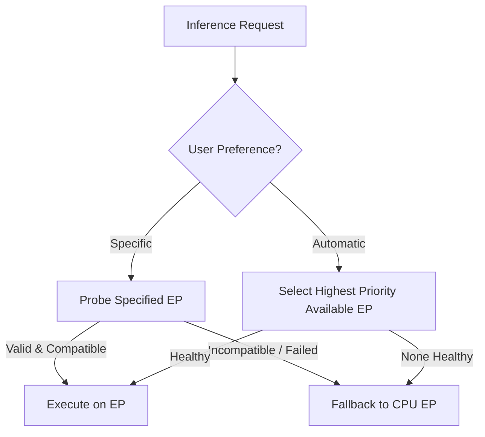

# Execution Provider Compatibility & Hardware Matrix

## 1. Scope & Provider Hierarchy

Resvera evaluates Execution Providers (EPs) within the unified `OrtEngine` architecture. In accordance with `ARCHITECTURE.md` Section 3.2 and `TECH_STACK.md` Section 3.2:

---

## 2. Platform Provider Matrix

| Platform | Primary Accelerated EP | Secondary Accelerated EP | Baseline Fallback EP | Precision Strategy |
|---|---|---|---|---|
| **Windows 10/11 x64** | DirectML (`DmlExecutionProvider`) | Windows ML (WinRT) | CPU (`CPUExecutionProvider`) | DirectML: FP16/FP32; CPU: FP32 |
| **macOS (Apple Silicon)** | CoreML (`CoreMLExecutionProvider`) | Metal Performance Shaders | CPU (`CPUExecutionProvider`) | CoreML: FP16/FP32; CPU: FP32 |
| **macOS (Intel x64)** | CPU (`CPUExecutionProvider`) | CoreML | CPU (`CPUExecutionProvider`) | CPU: FP32 |
| **Linux x64 (NVIDIA)** | CUDA (`CUDAExecutionProvider`) | TensorRT | CPU (`CPUExecutionProvider`) | CUDA: FP16/FP32; CPU: FP32 |
| **Linux x64 (Intel)** | OpenVINO (`OpenVINOExecutionProvider`)| None | CPU (`CPUExecutionProvider`) | OpenVINO: FP16/FP32; CPU: FP32 |
| **Linux x64 (AMD/Other)**| CPU (`CPUExecutionProvider`) | None | CPU (`CPUExecutionProvider`) | CPU: FP32 |

---

## 3. Provider Validation & Safety Guarantees

1. **Deterministic CPU Fallback:**
   - Every platform is guaranteed a working offline CPU inference path.
   - The CPU EP requires no external GPU drivers, DirectX 12 runtimes, or network connectivity.
2. **DirectML Compatibility Path:**
   - DirectML works across AMD, Intel, and NVIDIA GPUs on Windows 10/11 with DirectX 12 support.
   - No proprietary vendor SDK (like CUDA) is required on user machines for Windows GPU acceleration.
3. **CoreML Model Constraints:**
   - Apple Neural Engine (ANE) accelerates CoreML when tensors conform to static dimensions and opset constraints.
   - Dynamic shape graphs on CoreML may fall back to CPU nodes within the CoreML runtime; models must be validated before advertising ANE acceleration.
4. **No Silent Network Fetching:**
   - Provider binaries (e.g. `DirectML.dll`, `onnxruntime_providers_shared.dll`) are loaded strictly from local application directories or system paths. If a provider library is missing, Resvera transitions cleanly to CPU fallback.
